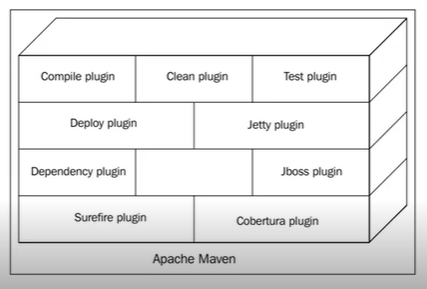
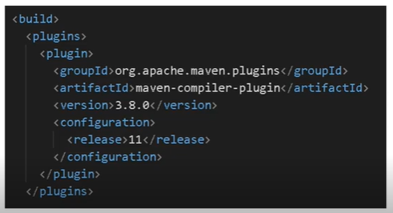

<h1 align="center"><b>Java com Maven</b></h1>

Sobre: Gerenciando dependências e build em Java com Maven.

**NOTA**: foram criados 2 projetos aqui: `quick-start-maven` e `project-parent` (este último desenvolvido mais ao final)

<h2>Pré requisitos</h2>

Ter o Java Instalado. Verifique usando o comando no terminal:

```SH
javac --version
```

<h2>O que é Apache Maven?</h2>

- É uma ferramenta para gerenciar build e dependências de um projeto;
- Primeira versão em julho de 2004. Mantido pela Apache Software Foundation;

<h3>Qual o problema o maven resolve?</h3>

Ferramentas como Maven são muito importantes. Vamos imaginar um projeto de médio ou grande porte.

Em Java, é muito provável que terá de dezenas a centenas de classes. Também existe toda uma organização de pacotes, arquivos de configuração, arquivos que informam a porta de servidores e IP, por exemplo.

Imagina ter que compilar cada classe de todos os pacotes que existem via linha comando, ou fazer tudo isto com os testes unitários. Imagine toda a complexidade disso. Ou transformar todo o projeto em uma "_imagem_" com Docker. Pois é o Maven resolve tudo isso.

Maven possui diversas ferramentas para melhor execução de testes e classes em Java e também suas compilações. Faz de forma automatizada o empacotamento e compilação e execução do projeto e testes...

<h3>O que é o Maven?</h3>

- Endereça como o software foi construído e suas dependências através do POM (Project Object Model);
- Facilita a compreensão do desenvolvedor;
- Fornecer informações de qualidade;

<h2>Instalação</h2>

Acesse o link e faça a instalação.

**Link**: https://maven.apache.org/

Após a instalação, faça a descompactação na pasta desejada da sua máquina. E após isso, verifique se já possui o Maven instalado e configurado

<h3>Configuração</h3>

Para verificar se está instalado, vá o terminal e digite:

```SH
mvn --version
```

Sabendo que não está instalado, acesse a pasta do Maven que você instalou e acessando sua pasta `bin/`, copie o path (caminho do diretório) e baseado no seu S.O, siga as seguintes instruções:

- **No Windows**
  - Adicionar no Path pelo Painel Controle > Sistema e Segurança > Sistema > Configurações avançadas do sistema > Avançado > Variáveis de ambiente
- **No Linux**
  - adicionar no PATH

Agora sim, verifique que o Maven está instalado e configurado (e sua versão):

```SH
mvn --version
```

Obs.: Verá que retorna também a versão do seu Java já instalado!

<h2>Primeiro projeto e conceitos</h2>

<h3>Criando um projeto via linha de comando</h3>

Digite no terminal:

```SH
mvn archetype:generate -DgroupId=edu.matheus -DartifactId=quick-start-maven -Darchetype=maven-archetype-quickstart -DinteractiveMode=false
```

Este comando traz um template/repositório de projeto da Internet de projetos Maven. Traz determinadas configurações e estruturas de pastas, e nesse caso tem a seguinte estrutura:

```SH
nome-do-projeto/
  src/
    main/
    test/
  pom.xml
README.md (que você está lendo agora)
```

<h3>Comando que ajudam no dia a dia</h3>

No terminal:

- Compilar: _mvn compile_. Todos o projeto será compilado e inserido na pasta `target/`;
- Testar: _mvn test_. Para testar a aplicação e realizar os testes e validações do projeto;
- Empacotar: _mvn package_. Empacota o projeto e cria o `jar` da aplicação;
- Limpar diretório de trabalho: _mvn clean_. Limpar o diretório de trabalho, deletando a pasta `target/`;

<h3>Apache Maven: criando diferentes tipos de projetos</h3>

O Maven archetype é um template que possibilita a personalização e a configuração de como será construído o projeto, como a versão dos componentes a serem usados, quais componentes serão inseridos, organização de pactotes e arquivos.

Para saber mais pesquise por: "_Maven Archertype List_". O próprio site do Apache Maven já traz essa lista

<h2>POM, dependências e repositórios</h2>

<h3>POM</h3>

- POM: _Project Object Model_;
- Unidade fundamental de trabalho do Apache Maven;
- Usa formato XML;
- Detalha o projeto;
- Detalha como construir o projeto;
- **NOTA**: Maven sempre procura pelo pom.xml para realizar sua execução;

<h4>Mais detalhes sobre POM.xml</h4>

- Nome do projeto;
- Dependências;
- Módulos;
- Configurações de build;
- Detalhes do projeto (nome, descrição, licença, url);
- Configurações de ambiente (repositórios, tracking, profiles);

Maven trabalha com o conceito de herança e este mesmo se extende para configurações do pom.xml. O resto das configurações se extendem de SUPER POM: que é um modelo base

<h3>Repositórios</h3>
- São locais onde podemos encontrar plugins e bibliotecas que o Maven provê;
- Dois tipos: Local e Remoto;

<h4>Repositório Remoto</h4>
É o local central utilizado pelo Maven para buscar os artefatos.
Configurado automaticamente pelo Super POM para utilizar o Maven Central

**Configuração**:

- Via settings.xml
- Localização: pasta_apache_maven/conf/settings.xml

<h4>Repositório Local</h4>
- É o repositório na máquina utilizado pelo Maven para buscar os artefatos.
- Estratégia de caching
- Localizações:	
  - Windows: %USERPROFILE%\.m2\repository
  - Linux: $HOME/.m2/repository

<h3>Como adicionar dependências</h3>

Para isso, devemos procurar por: pom.xml e dentro do mesmo procurar por `dependencies`. Pesquisar por um componente no site do Maven Repository (como Hibernate-validator) e escolher a versão desejada (sempre é melhor instalar a última). Após isso, copiar a dependência baseado no seu gerenciador (Maven nesse caso) e por fim compilar o projeto com _mvn compile_. Isso vai "instalar" o componente para a nossa aplicação.

- **groupId**: É como se fosse o id da organização. Segue as regras de nomes de pacote Java
- **artifactId**: Nome do projeto em si
- **Version**: Número da versão que será utilizada

<h2>Gerenciando dependências</h2>

<h3>Tipos de dependências</h3>

- **Direta**: dependências declaradas no pom.xml
- **Transitiva**: dependências obrigatórias das dependências declaradas no pom.xml

<h4>Um cenário</h4>

Vamos imaginar que queremos transformar nosso projeto em um componente, sim, publicar um componente que outras pessoas podem usar.

Para isto, basta usar o script: _mvn install_, que fará com que o projeto seja publicado localmente. Agora sendo uma dependência passível de uso.

Para usar o componente criado, basta copiar o _<artifactId>, <groupId> e <version>_ e levá-los para um outro projeto. E por último, informar o módulo que deseja usar.

<h3>Transitividade e Escopos</h3>

<h4>Um cenário de exemplo</h4>

O problema de dependências transitivas

### **Escopos**

- Para lidar com esse problema, o Maven provê escopos para limitar a transitividade das dependências. Existem 6 tipos de escopos que podemos utilizar.

#### **Classpath**

- Runtime;
- Test;
- Compile;

### **Escopo compile**

- Escopo default
- Disponível em todos os classpaths
- É transitivo

### **Escopo provided**

- Indica que a dependência será fornecida em tempo de execução por uma implementação na JDK ou via container;
- Exemplos: Servlet API, Java EE APIs;
- A dependência com esse escopo é adicionado no classpath usado para compilação(compile) e teste(test) mas não em runtime;
- Não é transitiva;

### **Escopo Runtime**

- Indica que a dependência é necessária para execução e não para compilação
- Maven inclui no classpath dos escopos de runtime e test

### **Escopo Test**

- Disponível somente para compilação e execução de testes
- Não é transitivo

### **Escopo system**

- Similar ao escopo provided exceto por ser necessário prover o JAR explicitamente
- A dependência com esse escopo é adicionado no classpath usado para compilação(compile) e teste(test) mas não em runtime;
- Não é transitiva

### **Escopo import**

- Este escopo é disponível apenas com uma dependência do tipo pom e com tag `<dependencyManagement>`
- Indica um processo de reutilizar dependências de um projeto

<h3>Dicas sobre escopos, dependências opicionais e exclusões</h3>

## **Ver o classpath**

- mvn dependency:build-classpath –DincludeScope=compile
- mvn dependency:build-classpath –DincludeScope=test
- mvn dependency:build-classpath –DincludeScope=runtime

### **Dependências opcionais**

Utilizado quando uma dependência não é necessária para os projetos que irão reutilizar seu componente

### **Eclusions**

Utilizado quando o componente que você usa compartilha uma biblioteca que você já tem ou não quer ter disponível

<h2>Maven Build Lifecycle</h2>

**O que é?**

- Conceito de ciclo de vida de construção
- Conceito e os comandos da ferramenta
- Composto por 3 ciclos de vida: Default -> Clean -> Site
- Cada ciclo possui fases (Maven Phases)
- Cada fase possui objetivos (Maven Goals)

### **Default Lyfecycle**

- Principal ciclo
- Responsável pelo deploy local
- Composto por 23 fases

#### **Principais fases**

Cada fase é um comando:

- validate
- compile
- test-compile
- test
- integration-test
- package
- install
- deploy

### **Clean Lifecycle**

- Ciclo intermediário
- Responsável pela limpeza do projeto, e preparação para publicação
- Composto por 3 fases

#### **Fases**

Cada fase é um comando:

- pre-clean
- clean
- post-clean

### **Site Lyfecycle**

- Ciclo final
- Responsável pela criação do site de documentação do projeto
- Composto por 4 fases

#### **Fases**

Cada fase é um comando:

- pre-site
- site
- post-site
- site-deploy

<h2>Projetos Multi-módulos</h2>

vamos imaginar um time que cuida de mais de um projeto, como: core, service, webapp, e um projeto controller. Cada projeto desses possui um repositório separado, estrutura separada de empacotamento, isso em projeto com Maven.

Gerenciar tudo isso, é dificil, mesmo com Maven. Imagina esse time trabalhando nesses projetos em uma mesma feature, pois é, seria bem trabalhoso realizar qualquer feature nova.

Para solucionar este problema, surgiram os projetos multi-módulos, onde: existe um projeto agregador que possui sub-módulos. Então, voltando para o cenário que estamos explorando, teríamos um projeto e dentro do mesmo teríamos vários sub-módulos: um para core, outro para service, outro para webapp e outro para controller.

<h3>Projeto Multi-módulo na prática</h3>

```SH
mvn archetype:generate -DgroupId=edu.matheus -DartifactId=project-parent -DarchetypeId=maven-quick-start
```

Após isso, vamos criar nossos sub-módulos: core, service, webapp, controller

```SH
mvn archetype:generate -DgroupId=edu.matheus -DartifactId=core -DarchetypeId=maven-quick-start -DinterativeMode=false

mvn archetype:generate -DgroupId=edu.matheus -DartifactId=service -DarchetypeId=maven-quick-start -DinterativeMode=false

mvn archetype:generate -DgroupId=edu.matheus -DartifactId=webapp -DarchetypeId=maven-quick-start -DinterativeMode=false

mvn archetype:generate -DgroupId=edu.matheus -DartifactId=controller -DarchetypeId=maven-quick-start -DinterativeMode=false
```

Após isso, veremos que ao nosso projeto parent foi adicionado tags `<module>` que indicam os sub-módulos criados. É algo realemnte bom e muito útil. Podemos ainda ver no arquivo `pom.xml` de cada sub-módulo criado que possuem uma tag `<parent>` que indicam o projeto parent criado

<h2>Plugins</h2>

**O que são plugins?**

- A maioria das funcionalidades são providas por plugins;
- Estilo arquitetural para extensibilidade (criar seu próprio plugin);
- Escrito prioritariamente em Java e disponibilizados comumente como JARs;

Vale ressaltar que todos comando que usamos até aqui (_compile, clean, install, test, package_) são na verdade plugins. Ou seja, toda a arquitetura do Maven é construída baseada em plugins, o que ajuda e muito na escalabilidade.



### **Plugins mais usados**

- eclipse
- jacoco
- ear
- war
- compile
- clean
- checkstyle
- javadoc

### **Uso**

`mvn [plugin-name]:[goal-name]`

Por exemplo:

```SH
mvn dependency:help
```

### **Configuração**



### **Gerando JavaDoc**

Em pom.xml, adicione dentro de plugins:

```XML
<plugin>
  <groupId>org.apache.maven.plugins</groupId>
  <artifactId>maven-javadoc-plugin</artifactId>
  <version>3.5.0</version>
</plugin>
```

E execute no terminal:

```SH
mvn javadoc:javadoc
```

A documentação será gerada na pasta `target/` dentro do project-parent.

<h2>Obrigado</h2>

Disponibilizado com ❤ por [pratesMatheus](https://github.com/pratesMatheus "pratesMatheus").
